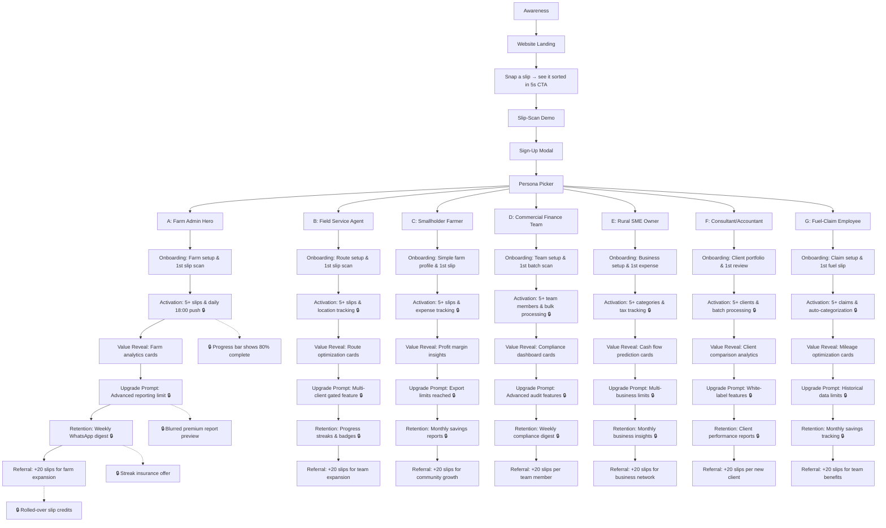

# FarmSlip App User Journey Map

## User Journey Flowchart



## KPI Summary Table

```markdown
| Stage | Farm Admin Hero | Field Service Agent | Smallholder Farmer | Commercial Finance Team | Rural SME Owner | Consultant/Accountant | Fuel-Claim Employee |
|-------|----------------|--------------------|--------------------|------------------------|-----------------|----------------------|-------------------|
| **Onboarding (Day 0)** | 1st slip scanned with farm context | 1st slip scanned with location data | 1st expense slip categorized | 1st batch of slips processed | 1st business expense recorded | 1st client slip reviewed | 1st fuel receipt claimed |
| **Activation (Week 1)** | ≥5 slips + daily 18:00 farm summary push | ≥5 slips + route optimization enabled | ≥5 slips + expense categories setup | ≥5 team members active + bulk processing used | ≥5 different expense categories used | ≥5 clients onboarded + batch review workflow | ≥5 fuel claims + auto-categorization active |
| **Value Reveal** | Farm analytics dashboard engagement | Route efficiency improvements shown | Profit margin insights accessed | Compliance score improvements | Cash flow predictions viewed | Client comparison analytics used | Mileage savings calculations shown |
| **Upgrade Prompt** | Advanced reporting limit reached | Multi-client features requested | Export/sharing limits hit | Advanced audit features needed | Multi-business account limits | White-label branding requested | Historical data access limits |
| **Retention Loop** | Weekly WhatsApp farm digest opened | Progress streaks maintained | Monthly savings reports engagement | Weekly compliance digest review | Monthly business insights accessed | Client performance reports sent | Monthly fuel savings tracking |
| **Referral Ask** | +20 slips for farm team expansion | +20 slips for service team growth | +20 slips for farmer community | +20 slips per referred team member | +20 slips for business network | +20 slips per new client referral | +20 slips for employee benefits |
```

## Sunken-Cost Tactics Implementation

- **🔒 Progress Bar**: Shows completion percentage at key friction points
- **🔒 Blurred Report Preview**: Teases premium insights before upgrade
- **🔒 Streak Insurance**: Offers to protect achievement streaks
- **🔒 Rolled-over Slip Credits**: Carries unused processing credits forward